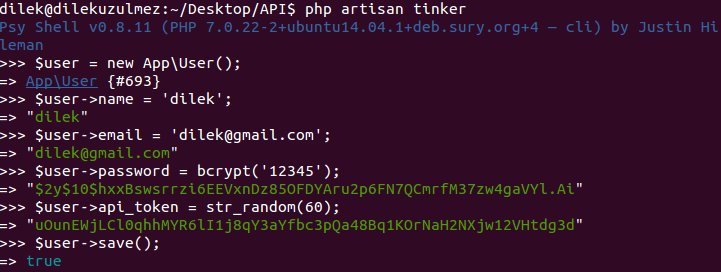
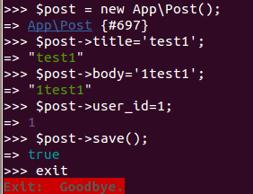
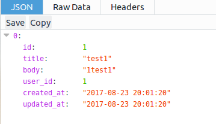

### REST API Laravel 5.4 with Token Authentication

##### ADIM 1:
 <pre><code>$ composer create-project laravel/laravel RestAPILaravel </code></pre>
 <pre><code>$ cd RestAPILaravel</code></pre>

##### ADIM 1.1:
<pre><code>$ mysql -u [username] -p
mysql> create database api;
mysql> exit </code></pre>

##### ADIM 1.2:
Projemizin .env dosyasına giderek veritabanı bilgilerimizi dolduruyoruz.
 <pre><code>DB_CONNECTION=mysql
DB_HOST=replace with your IP
DB_PORT=3306
DB_DATABASE=api
DB_USERNAME=[username]
DB_PASSWORD=[password] </code></pre>

##### ADIM 2:

Users migration tablomuza giderek aşağıdaki şekilde dosyayı güncelliyoruz. [2014_10_12_000000_create_users_table.php]
 <pre><code>public function up()
{
  Schema::create('users', function (Blueprint $table) {
  $table->increments('id');
  $table->string('name');
  $table->string('email')->unique();
  $table->string('password');
  $table->string('api_token', 60)->unique();
  $table->rememberToken();
  $table->timestamps();
  });
}</code></pre>
User modelimize giderek aşağıdaki şekilde güncelliyoruz.[User.php]
 <pre><code>protected $fillable = [
        'name', 'email', 'password', **'api_token'**,
];</code></pre>

##### ADIM 2.1:
Şimdi Post modelimizi ve migrations'ımızı oluşturmak için aşağıdaki komutu çalıştırıyoruz.
<pre><code>$  php artisan make:model Post -m </code></pre>

Post modelimize giderek aşağıdaki şekilde Foreign key olarak User modeli ile olan ilişkisini yazıyoruz.[Post.php]

<pre><code>public function user() {
   return $this->belongsTo(User::class);
} </code></pre>

User modelimize giderek aşağıdaki ilişkiyi yazıyoruz.
<pre><code>public function posts() {
   return $this->hasMany(Post::class);
} </code></pre>

Posts migration tablomuza giderek aşağıdaki şekilde dosyayı güncelliyoruz.[2017_08_23_194621_create_posts_table.php]
<pre><code>public function up()
{
  Schema::create('posts', function (Blueprint $table) {
  $table->increments('id');
  $table->string('title');
  $table->text('body');
  $table->integer('user_id');
  $table->timestamps();
  });
}</code></pre>
Post modelimize giderek aşağıdaki şekilde güncelliyoruz.[Post.php]
<pre><code>protected $fillable = [
  'title', 'body', 'user_id',
];</code></pre>
Aşağıdaki komut ile veritabanını güncelliyoruz.
<pre><code>$ php artisan migrate:refresh </code></pre>

##### ADIM 3:

Şimdi bir APIController oluşturacağız.
<pre><code>$ php artisan make:controller APIController --resource </code></pre>
APIController'ımızı aşağıdaki şekilde güncelleyelim.[APIController.php]
<pre><code>public function index()
{
  $posts = Post::all();
  return response()->json($posts);
}</code></pre>

!!Dosyamızın en üst kısmına bunu yazmayı unutmuyoruz:
<pre><code>use App\Post; </code></pre>

##### ADIM 4:

<pre><code>$ php artisan tinker 'komutunu çalıştırıyoruz.</code></pre>

User eklemek için:

Post eklemek için:

##### ADIM 5:
Router'ı düzenleceğiz şimdi. [api.php]
<pre><code>Route::group(['middleware' => 'auth:api'], function () {
    Route::resource('post', 'APIController');
}); </code></pre>

##### ADIM 6:
Authentication'ı etkinleştiriyoruz.
<pre><code>$ php artisan make:auth </code></pre>

##### ADIM 7:
<pre><code>$ php artisan serve</code></pre>

Şimdi browserımızı açıp URL'a api_token'ımızı yazacağız.

<pre><code>localhost:8000/api/post?api_token=uOunEWjLCl0qhhMYR6lI1j8qY3aYfbc3pQa48Bq1KOrNaH2NXjw12VHtdg3d </code></pre>

Ve mutlu son :tada: :tada: :tada:
